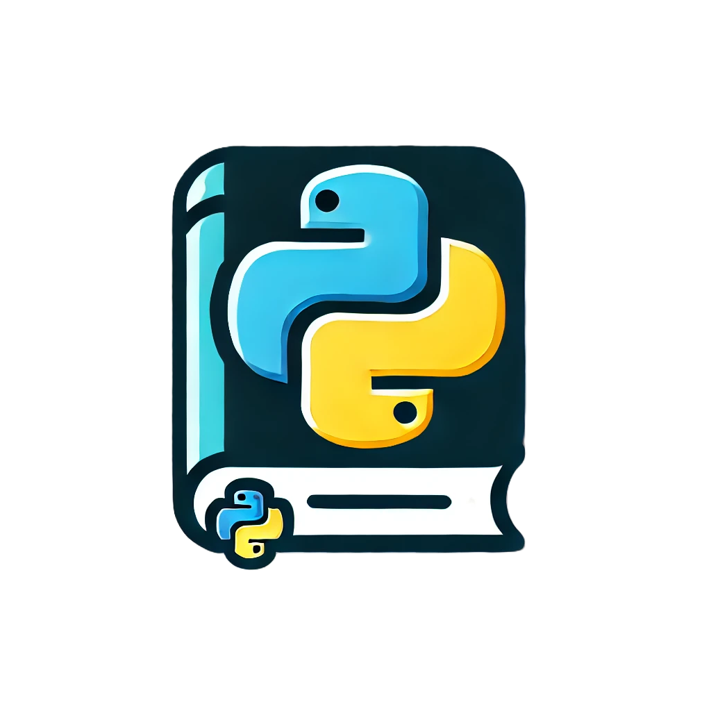
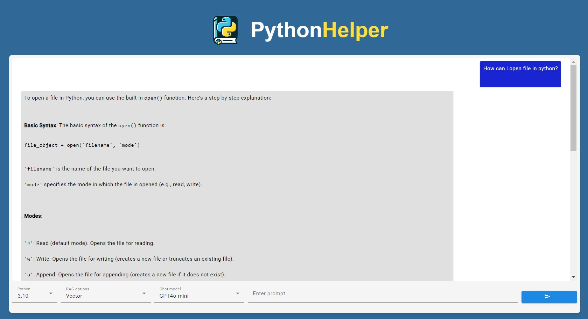
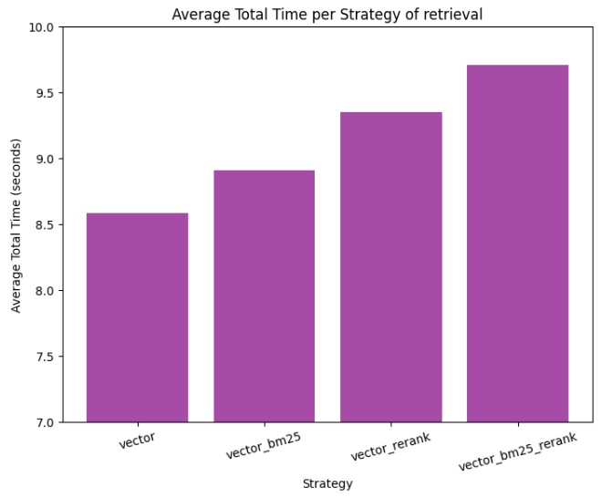
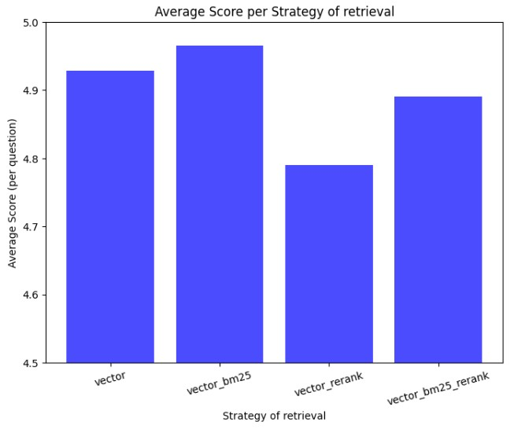
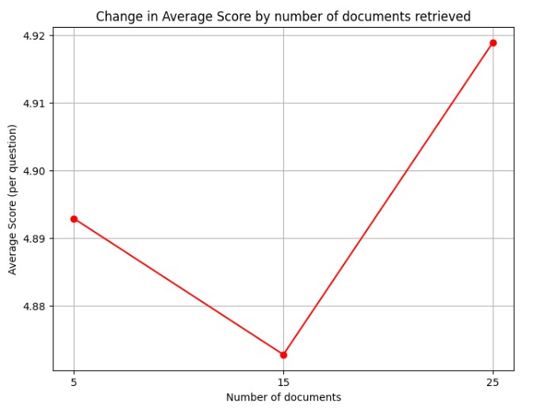

# PythonHelper 

## Overview  
This application is designed to enhance the learning experience of new programmers in Python. It leverages the **GPT-4o-mini** model to provide AI-powered assistance tailored to the user's needs.  

## Key Features  
- **Python Version Selection** - Users can choose the Python version they want to learn (3.10, 3.11, 3.12, 3.13)
- **RAG-Based Retrieval** - The app offers **four types of RAG (Retrieval-Augmented Generation) retrieval options**, allowing users to access relevant information efficiently.  

## Technologies Used  
- **GPT-4o-mini** - LLM for intelligent responses.  
- **ChromaDB** - Vector database for efficient retrieval.  
- **RAG Implementation** - Enhances the relevance of provided information.  
- **Fine-Tuning** - Fine-Tuned GPT-4o-mini using OpenAI api
- **FastAPI** - Bridge between user and LLM
- **Angular** - Enables user to ask FastAPI a question



## Breakdown of development process 
### Web Scraping  

To begin, I needed to load data for RAG-based retrieval. To ensure the most reliable information for the best LLM responses, I chose two key sources:  

- **Python documentation**  
- **Stack Overflow**  

I scraped the entire Python documentation using **BeautifulSoup** and retrieved users' Python-related questions from Stack Overflow via the StackExchange API.  

Next, I had to decide how to store the data. I opted for **ChromaDB** due to its ease of use. I also needed to preprocess the extracted data to make it more structured and readable. Based on their HTML tags, I reformatted the data into a more digestible format, improving LLM retrieval quality.  

To store embeddings in the vector database, I chunked the data dynamically, adjusting chunk sizes as needed. For embedding generation, I used the ```text-embedding-ada-002``` model. Additionally, I wanted to incorporate BM25 for better keyword-based retrieval, so I stored the documents in an **SQLite** database as well.

---

### RAG Pipeline Creation  

To provide users with flexibility in retrieving documents from the database, I implemented multiple retrieval strategies. This allows users to choose the method that best suits their needs. I decided to include four different retrieval options:  

- **Vector retrieval from the vector store**  
- **Vector retrieval combined with BM25**  
- **Vector retrieval with reranking**  
- **Vector retrieval with BM25 and reranking**  

Each method enhances the retrieval process in a different way. Below, I explain how each of them is implemented.  


#### Vector Retrieval from the Vector Store  

This method relies purely on **vector similarity search**. Given a user's prompt, I first generate its embedding and search for the **top-k** most relevant documents in the vector store. These retrieved documents are then added to the context for the LLM to generate a response.  


#### Vector Retrieval and BM25  

To improve the retrieval accuracy, this method **combines vector search with BM25 scoring**. It follows these steps:  

1. Perform **vector retrieval** to find the **top-k** most relevant documents.  
2. Retrieve additional relevant documents using **BM25**, a ranking function based on term frequency and inverse document frequency (TF-IDF).  
3. Merge both sets of results, ensuring that both semantic and keyword-based relevance are considered.  

This hybrid approach enhances recall by capturing both **semantic similarity** (via vector embeddings) and **exact keyword matches** (via BM25).  


#### Vector Retrieval and Reranking  

This method refines the retrieved documents by applying a **reranking model** after vector retrieval. The process is as follows:  

1. Retrieve the **top-k** most relevant documents using **vector search**.  
2. Use a **cross-encoder reranking model**, specifically ```cross-encoder/ms-marco-MiniLM-L-6-v2```, to **re-evaluate** and rank the retrieved documents.  
3. Only the most relevant parts of the documents are added to the context.  

By reranking the initial results, this approach prioritizes the most **contextually relevant** documents rather than relying solely on vector similarity.  


#### Vector Retrieval, BM25, and Reranking

This is the most **comprehensive** retrieval method, combining all previous techniques:  

1. Retrieve the **top-k** documents using **vector search**.  
2. Retrieve additional documents using **BM25** for keyword-based ranking.  
3. Merge and rerank the retrieved documents using ```cross-encoder/ms-marco-MiniLM-L-6-v2```.  
4. Select only the most relevant sections and add them to the context.  

This approach ensures that the LLM receives the **most relevant, diverse, and high-quality** information by leveraging **semantic similarity, keyword matching, and reranking models** together.  

#### Comparison of time needed to compute each method of RAG and retrieval response from LLM




From the graph, we can observe that the **fastest method** is **Vector Retrieval from the Vector Store**, while the **slowest** is **Vector Retrieval, BM25, and Reranking**. This outcome aligns with expectations:  

- **Vector retrieval** is the simplest approach, requiring only a single embedding search in the vector database, making it the most time-efficient.  
- **Vector Retrieval, BM25, and Reranking** involves multiple processing steps—vector retrieval, keyword-based BM25 search, and cross-encoder reranking—which naturally increases computation time.  

#### Performance Differences  

Interestingly, despite the added complexity of **BM25 and reranking**, the time difference between the fastest and slowest methods is **only about one second**. This suggests that even the most comprehensive retrieval strategy does not introduce a significant latency penalty, making it a viable option when higher-quality retrieval is needed.  

---

### Fine Tuning

In this project, I performed **fine-tuning** of an LLM (Large Language Model) using the **OpenAI API**. The goal was to improve the model's ability to generate Python code based on queries. To achieve this, I utilized the **MBPP (Mostly Basic Python Programming)** dataset from **Hugging Face**, which contains pairs of natural language queries and their corresponding Python code solutions.  

#### Dataset: MBPP  

The **MBPP dataset** is a benchmark dataset designed for evaluating code generation models. It consists of:  

- **Queries**: Natural language descriptions of programming tasks.  
- **Python code**: Correct implementations solving the described tasks.  

I loaded the dataset from Hugging Face using the `datasets` library 

---
### Backend & Frontend

For this project, I decided to use **FastAPI** for the backend and **Angular** with **Angular Material** for the frontend. This combination provides a powerful, scalable, and efficient solution for building modern web applications with a responsive user interface and a high-performance API.  


## Testing

To evaluate the performance of my models and RAG pipelines, I prepared a **set of 30 Python-related questions**. These questions covered various aspects of Python programming, including syntax, built-in functions, and best practices.  

**Example question:**  
> *How do you use the `map()`, `filter()`, and `reduce()` functions?*  

Each question was tested across **all possible combinations** of:  
- **RAG retrieval strategies**  
- **Number of retrieved documents** (5, 15, and 25)  

#### Evaluation Method: LLM as a Judge  

To compare the quality of responses, I employed the **LLM-as-a-Judge** approach. Instead of manually grading the responses, I used an **LLM to assess the quality** of each generated answer. The LLM assigned a **score from 1 to 5**, reflecting how well the response addressed the given question.  




From the graph we can observe that strategy **Vector Retrieval with BM25** returned the best results, which were very close to being perfect and the worst was **Vector Retrieval with Rerank**. 


### Why Vector + BM25 performed the best?

The strong performance of **BM25** can be attributed to its underlying retrieval mechanism:  
- BM25 excels at **keyword-based matching**, which is particularly useful for **programming-related tasks** where **precise wording and terminology are crucial**.  
- Combining **Vector retrieval** and **BM25** allows us to have documents based on keywords and based on semantic meaning.


Next, I investigated how the **number of documents retrieved** affects the **quality of responses**. The goal was to determine whether increasing the number of retrieved documents significantly improves the results.  

To ensure consistency, I used the **same set of questions, retrieval strategies, and document count variations** as in the previous experiment.  



#### Conclusions from graph

- The **difference between the highest and lowest scores** in this experiment was only **0.05**, meaning that increasing the number of retrieved documents **barely affected** the response quality.  
- In contrast, in the previous experiment, the **score variation between retrieval strategies** was about **0.20**—**four times larger** than the effect of document count.  
- This suggests that **retrieval strategy selection is far more important** than simply increasing the number of documents available to the LLM.  

## Summary  

### **PythonHelper: AI-Powered Python Learning Assistant**  

**PythonHelper** is an advanced web-based application designed to assist programmers in learning Python. By integrating **LLM-powered assistance**, **RAG-based retrieval**, and **fine-tuning techniques**, it provides high-quality responses tailored to the user's queries.  

---

### **Key Features**  

✅ **Python Version Selection** – Users can choose from multiple Python versions (3.10, 3.11, 3.12, 3.13).  
✅ **RAG-Based Retrieval** – Four retrieval strategies for optimized information retrieval.  
✅ **Fine-Tuned LLM** – Custom fine-tuned **GPT-4o-mini** model for improved code generation.  
✅ **Web-Based Interface** – Developed using **FastAPI** (backend) and **Angular + Angular Material** (frontend).  

---

### **How It Works**  

1️⃣ **Web Scraping** – Extracts data from **Python documentation** and **Stack Overflow** using **BeautifulSoup** and the **StackExchange API**.  
2️⃣ **Data Processing & Storage** – Stores processed documents in **ChromaDB** (vector storage) and **SQLite** (BM25 indexing).  
3️⃣ **RAG Pipeline** – Implements multiple retrieval strategies:  
   - **Vector Retrieval**  
   - **Vector + BM25 Retrieval**  
   - **Vector Retrieval + Reranking**  
   - **Vector + BM25 + Reranking**  
4️⃣ **Fine-Tuning** – Custom fine-tuned **GPT-4o-mini** model trained on **MBPP dataset** from Hugging Face.  
5️⃣ **User Interaction** – Users input Python-related queries, and responses are generated using **retrieval-augmented generation (RAG)** techniques.  

---

### **Testing & Evaluation**  

- **30 Python-related questions** were used for benchmarking different retrieval strategies.  
- The **LLM-as-a-Judge** approach was used to score responses from **1 to 5** based on relevance and accuracy.  
- **Findings:**  
  ✅ **Vector Retrieval + BM25** achieved the highest accuracy due to strong **keyword-based matching**.  
  ❌ **Vector Retrieval + Rerank** performed the worst, showing that reranking alone is less effective for programming queries.  
  🔹 The **number of retrieved documents had a minimal impact** compared to retrieval strategy choice.  

---

### **Key Takeaways**  

📌 **BM25 significantly improves retrieval accuracy for code-related queries** due to its keyword-matching strength.  
📌 **Increasing the number of retrieved documents has a negligible effect** on response quality.  
📌 **Combining vector search with BM25 provides the best balance between semantic meaning and exact term matching.**  

---

### **Future Improvements**  

🚀 **Improve Dataset** - At the of development i noticed that some of documents in vector database are too slow and doesn't have context  
🚀 **Optimize Fine-Tuning** - Experiment with better datasets, because the fine tuned model returns hallucinations
---

### **Conclusion**  

**PythonHelper** is an innovative, AI-driven tool designed to **simplify learning Python**, offering an efficient and user-friendly approach to programming assistance. By leveraging **state-of-the-art retrieval strategies** and an **intuitive web interface**, it provides **high-quality, context-aware answers** to Python-related queries.  

This project demonstrates the power of **RAG**, **fine-tuning**, and **LLM-based evaluation**, paving the way for more intelligent and adaptive learning tools in the future. 🚀🔥  
